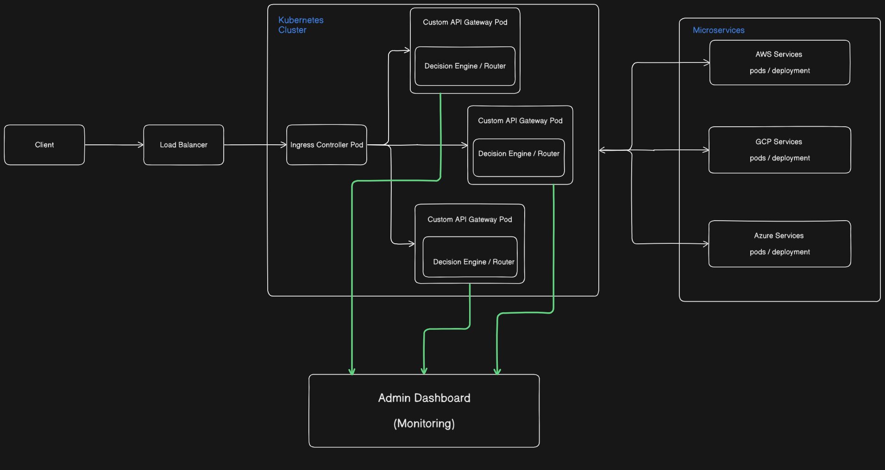

# Resource Allocator Manager (KubeLitho)

Welcome to the **Resource Allocator Manager**, a comprehensive microservices-based application built to dynamically provision, manage, and monitor Kubernetes resources based on a secure, role-based authentication system.

## 🚀 Features

- **Microservices Architecture:** Independently scalable frontend, auth, and resource management services.
- **Dynamic Kubernetes Provisioning:** Automatically allocate and deallocate specific Kubernetes resources (Pods, Deployments) via an API service.
- **Secure Authentication:** Go Fiber-backed authentication using JWT tokens and PostgreSQL for role-based access control (Admin vs. Standard User).
- **Monitoring & Observability:** Real-time metrics visualization using a pre-configured Prometheus and Grafana setup out of the box.
- **Modern Web Dashboard:** A responsive, dark-mode Next.js frontend to control your infrastructure and view relevant stats seamlessly.

## 🏗️ Architecture Stack



The project relies on multiple interconnected services under the `services/` directory:

### 1. Frontend Dashboard (`/services/frontend-dashboard`)
- **Technology:** Next.js, React 19, Tailwind CSS v4, TypeScript
- **Details:** Provides the administrative user interface. It acts as the gateway to interact with the underlying microservices via API proxying, featuring secure pages that enforce user authentication.

### 2. Auth Service (`/services/auth-service`)
- **Technology:** Go (Golang), Fiber API Framework, GORM, PostgreSQL (Neon DB), JWT
- **Details:** The backbone of system security. Handles user registration, verification, secure password hashing, and generates JSON Web Tokens (JWT) required by all other microservices to authorize actions.

### 3. Resource Allocator Service (`/services/resource-allocator-service`)
- **Technology:** Node.js, Express, Prisma ORM, Kubernetes Client Node (`@kubernetes/client-node`)
- **Details:** The engine that interacts directly with the Kubernetes API. Validates the JWT tokens and allows authorized users to provision, track, or delete backend allocations (e.g., K8s pods) associated with their account.

## 🐳 Infrastructure & Deployment (`/k8s`)

The project contains Kubernetes manifest files to deploy the whole infrastructure smoothly structure via tools like `kind` or Minikube. 
- **Prometheus & Node Exporter:** Gathers deep system-level and orchestrator-level metrics.
- **Grafana:** Offers comprehensive visual dashboards for understanding resource allocation loads at a glance.

## ⚙️ Getting Started

### Prerequisites
- [Node.js](https://nodejs.org/) (v20+)
- [Go](https://golang.org/) (1.26+)
- [Docker & Kubernetes](https://kubernetes.io/) (via Docker Desktop, Minikube, or `kind`)
- A PostgreSQL Database (e.g., [Neon DB](https://neon.tech/) or local Docker postgreSQL image).

### Environment Setup

Each individual microservice requires its own `.env` file configuration (e.g., `DATABASE_URL` for PostgreSQL credentials, `JWT_SECRET`, and internal service routing endpoints). Be sure to configure the corresponding variables inside their directories.

### Running the Application

1. **Start the Auth Service:**
   ```bash
   cd services/auth-service
   go run main.go
   ```

2. **Start the Resource Allocator Service:**
   ```bash
   cd services/resource-allocator-service
   npm install
   npm run dev
   ```

3. **Start the Frontend Dashboard:**
   ```bash
   cd services/frontend-dashboard
   npm install
   npm run dev
   ```

Once all services are running, the Next.js frontend will typically be available on `http://localhost:3000` or `http://localhost:3001` depending on standard port availability.

## 🛡️ License
This project is licensed under the ISC License.
